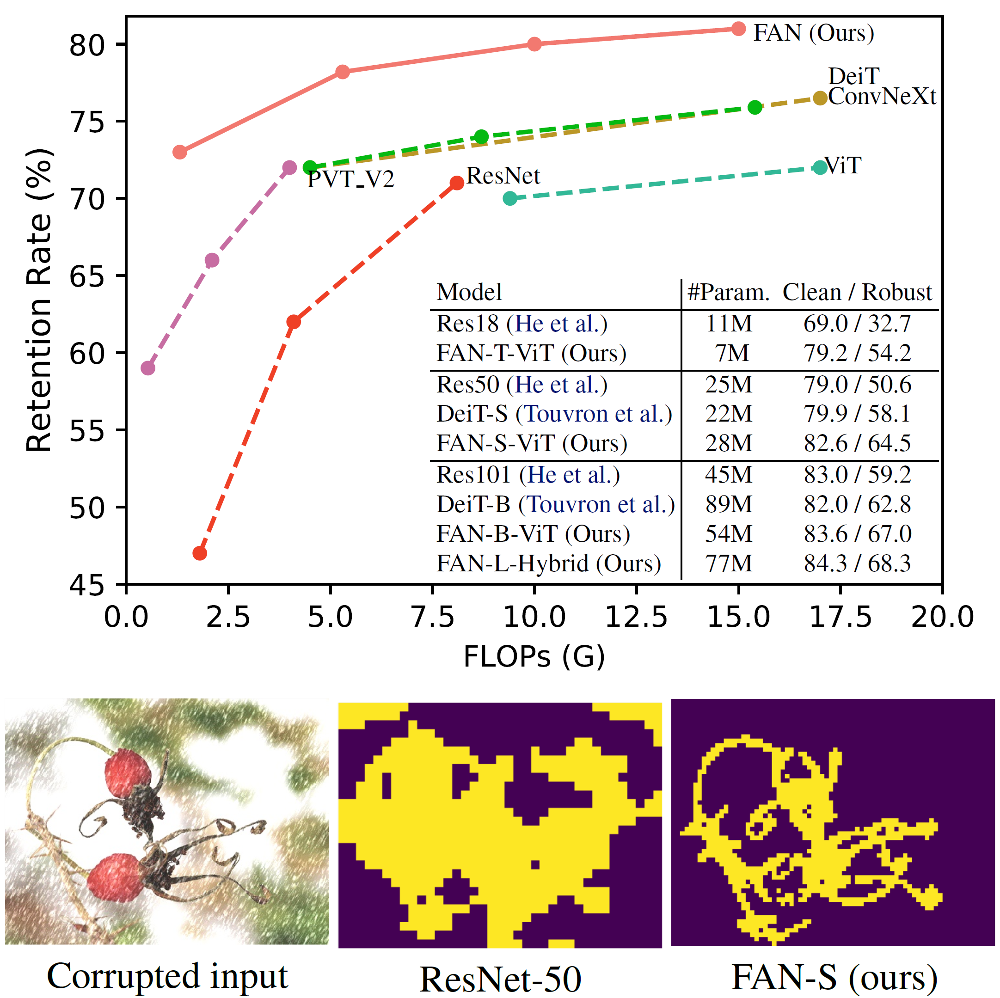

# Fully Attentional Networks
[](https://paperswithcode.com/sota/domain-generalization-on-imagenet-c?p=understanding-the-robustness-in-vision) [](https://paperswithcode.com/sota/domain-generalization-on-imagenet-r?p=understanding-the-robustness-in-vision) [](https://paperswithcode.com/sota/domain-generalization-on-imagenet-a?p=understanding-the-robustness-in-vision)
### [Project Page](https://github.com/NVlabs/FAN) | [Paper](https://arxiv.org/abs/2204.12451) | [Slides](https://docs.google.com/presentation/d/10PCDvHYeb3bvLTOZZR9puxGfoAIdwc8i/edit?usp=sharing&ouid=103738831029004572557&rtpof=true&sd=true) | [Poster](https://drive.google.com/file/d/1wQMRdUI7YqVMBJBxSAI_efHUddDDQOQc/view?usp=sharing)

Understanding The Robustness in Vision Transformers. \
[Daquan Zhou](https://scholar.google.com/citations?user=DdCAbWwAAAAJ&hl=en), [Zhiding Yu](https://chrisding.github.io/), [Enze Xie](https://xieenze.github.io/), [Chaowei Xiao](https://xiaocw11.github.io/), [Anima Anandkumar](https://research.nvidia.com/person/anima-anandkumar), [Jiashi Feng](https://sites.google.com/site/jshfeng/home) and [Jose M. Alvarez](https://alvarezlopezjosem.github.io/). \
International Conference on Machine Learning, 2022.

<p align="center">

</p>

This repository contains the official Pytorch implementation of the training/evaluation code and the pretrained models of [Fully Attentional Network](https://arxiv.org/abs/2204.12451) (**FAN**).

**FAN** is a family of general-purpose Vision Transformer backbones that are highly robust to unseen natural corruptions in various visual recognition tasks.

## Catalog
- [ ] ImageNet-22K Fine-tuning Code Release
- [ ] Cityscape-C and COCO-C Dataset Release
- [x] Pre-trained Model Release
- [x] Cityscape-C and COCO-C Dataset Generation Script
- [x] Downstream Transfer (Detection, Segmentation) Code Release
- [x] ImageNet-1K Training & Fine-tuning Code Release
- [x] Init Repo


<!-- ✅ ⬜️  -->

# Dependencies
The repo is built based on timm library, which can be installed via:
pip3 install timm==0.5.4
pip3 install torchvision==0.9.0

# Dataset preparation
Download [ImageNet](http://image-net.org/) clean dataset and [ImageNet-C](https://zenodo.org/record/2235448) dataset and structure the datasets as follows:

```
/path/to/imagenet-C/
  clean/
    class1/
      img3.jpeg
    class2/
      img4.jpeg
  corruption1/
    severity1/
      class1/
        img3.jpeg
      class2/
        img4.jpeg
    severity2/
      class1/
        img3.jpeg
      class2/
        img4.jpeg
```

For other out-of-distribution shift benchmarks, we use [ImageNet-A](https://github.com/hendrycks/natural-adv-examples) or [ImageNet-R](https://github.com/hendrycks/imagenet-r/) for evaluation.

## Results and Pre-trained Models
### FAN-ViT ImageNet-1K trained models

| Model | Resolution |IN-1K | IN-C| IN-A| IN-R | #Params | Download |
|:---:|:---:|:---:|:---:| :---:|:---:|:---:|:---:|
| FAN-T-ViT | 224x224 | 79.2 | 57.5| 15.6 | 42.5 | 7.3M | [model](https://github.com/zhoudaquan/fully_attentional_network_ckpt/releases/download/v1.0.0/fan_vit_tiny.pth.tar) |
| FAN-S-ViT | 224x224 | 82.5 | 64.5| 29.1 | 50.4 | 28.0M  | [model](https://github.com/zhoudaquan/fully_attentional_network_ckpt/releases/download/v1.0.0/fan_vit_small.pth.tar) |
| FAN-B-ViT | 224x224 | 83.6 | 67.0| 35.4 | 51.8 | 54.0M  | [model](https://github.com/zhoudaquan/fully_attentional_network_ckpt/releases/download/v1.0.0/fan_vit_base.pth.tar) |
| FAN-L-ViT | 224x224 | 83.9 | 67.7| 37.2 | 53.1 | 80.5M | [model]() |

### FAN-Hybrid ImageNet-1K trained models
| Model | Resolution |IN-1K / IN-C| City / City-C| COCO / COCO-C | #Params | Download |
|:---:|:---:|:---:|:---:|:---:|:---:|:---:|
| FAN-T-Hybrid | 224x224 | 80.1/57.4 | 81.2/57.1 | 50.2/33.1 | 7.4M | [model](https://github.com/zhoudaquan/fully_attentional_network_ckpt/releases/download/v1.0.0/fan_hybrid_tiny.pth.tar) |
| FAN-S-Hybrid | 224x224 | 83.5/64.7 | 81.5/66.4 | 53.3/38.7 |26.3M | [model](https://github.com/zhoudaquan/fully_attentional_network_ckpt/releases/download/v1.0.0/fan_hybrid_small.pth.tar) |
| FAN-B-Hybrid | 224x224 | 83.9/66.4| 82.2/66.9 | 54.2/40.6 |50.4M | [model](https://github.com/zhoudaquan/fully_attentional_network_ckpt/releases/download/v1.0.0/fan_hybrid_base.pth.tar) |
| FAN-L-Hybrid | 224x224 | 84.3/68.3| 82.3/68.7| 55.1/42.0 |76.8M | [model]() |

### FAN-Hybrid ImageNet-22K trained models
| Model | Resolution |IN-1K/IN-C | #Params | Download |
|:---:|:---:|:---:|:---:|:---:|
| FAN-B-Hybrid | 224x224 | 85.3/70.5 | 50.4M  | [model](https://github.com/zhoudaquan/fully_attentional_network_ckpt/releases/download/v1.0.0/fan_hybrid_base_in22k_1k.pth.tar) |
| FAN-B-Hybrid | 384x384 | 85.6/- | 50.4M  | [model](https://github.com/zhoudaquan/fully_attentional_network_ckpt/releases/download/v1.0.0/fan_hybrid_base_in22k_1k_384.pth.tar) |
| FAN-L-Hybrid | 224x224 | 86.5/73.6 | 76.8M | [model](https://github.com/zhoudaquan/fully_attentional_network_ckpt/releases/download/v1.0.0/fan_hybrid_large_in22k_1k.pth.tar) |
| FAN-L-Hybrid | 384x384 | 87.1/- | 76.8M | [model](https://github.com/zhoudaquan/fully_attentional_network_ckpt/releases/download/v1.0.0/fan_hybrid_large_in22k_1k_384.pth.tar) |

The pre-trained model weights for [FAN-B-Hybrid](https://github.com/zhoudaquan/fully_attentional_network_ckpt/releases/download/v1.0.0/fan_hybrid_base_in22k.pth.tar) and [FAN-L-Hybrid](https://github.com/zhoudaquan/fully_attentional_network_ckpt/releases/download/v1.0.0/fan_hybrid_large_in22k.pth.tar) on ImageNet22K without fine-tuning on ImageNet-1k are also uploaded. Checkpoints cabn be downloaded by clicking on the model name.
## Demos
### Semantic Segmentation on Cityscapes-C

<p align="center">

</p>


## ImageNet-1K Training 
FAN-T training on ImageNet-1K with 4 8-GPU nodes:
```
python3 -m torch.distributed.launch --nproc_per_node=8 --nnodes=$rank_num \
	--node_rank=$rank_index --master_addr="ip.addr" --master_port=$MASTER_PORT \
	 main.py  /PATH/TO/IMAGENET/ --model fan_tiny_8_p4_hybrid -b 32 --sched cosine --epochs 300 \
	--opt adamw -j 16 --warmup-epochs 5  \
	--lr 10e-4 --drop-path .1 --img-size 224 \
	--output ../fan_tiny_8_p4_hybrid/ \
	--amp --model-ema \
```

## Robustness on ImageNet-C
```
bash scripts/imagenet_c_val.sh $model_name $ckpt
```

## Measurement on ImageNet-A
```
bash scripts/imagenet_a_val.sh $model_name $ckpt
```

## Measurement on ImageNet-R
```
bash scripts/imagenet_r_val.sh $model_name $ckpt
```

## Acknowledgement
This repository is built using the [timm](https://github.com/rwightman/pytorch-image-models) library, [DeiT](https://github.com/facebookresearch/deit), [PVT](https://github.com/whai362/PVT) and [SegFormer](https://github.com/NVlabs/SegFormer) repositories.

## Citation
If you find this repository helpful, please consider citing:
```
@inproceedings{zhou2022understanding,
  title   = {Understanding The Robustness in Vision Transformers},
  author  = {Daquan Zhou, Zhiding Yu, Enze Xie, Chaowei Xiao, Anima Anandkumar, Jiashi Feng, Jose M. Alvarez},
  booktitle = {International Conference on Machine Learning (ICML)},
  year    = {2022},
}
```
